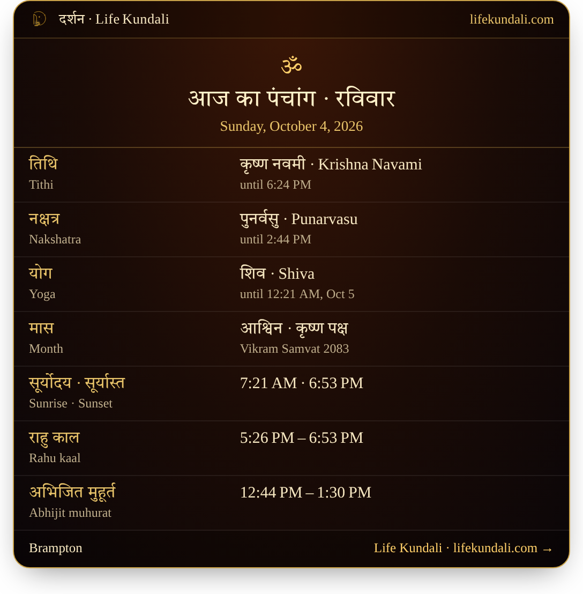

# Life Kundali widgets

Free panchang and festival-date widgets for temple, gurdwara and community websites. One line of HTML, no account, no cookies, no tracking.

Most calendars print India's festival dates. Abroad the day often differs: in 2026 Karva Chauth is Wednesday 28 October in Toronto, New York and London, but Thursday 29 October in India. These widgets show the dates worked out for **your own city's** sunrise, sunset and moonrise, in 156 cities.



## Use

```html
<div data-lk="festivals" data-city="Brampton"></div>
<script src="https://lifekundali.com/embed/lk.js" async></script>
```

Put as many `data-lk` boxes on a page as you like; one script tag serves them all.

| `data-lk` | Shows |
|---|---|
| `panchang` | Today's tithi, nakshatra, yoga, sunrise and sunset, Rahu kaal, Abhijit muhurat |
| `festivals` | The next Hindu, Sikh and Jain festivals, marked where your city differs from India |
| `gurdwara` | Gurpurabs only, names in Gurmukhi first |
| `gurughar` | Sangrand, Puranmashi, Masya and Gurpurabs, with today's sunrise and sunset |
| `muhurta` | The choghadiya running now and the next good period |
| `birth-chart` | A free birth chart tool for visitors |
| `matching` | Kundali matching (36 gunas) |

Options: `data-city="Surrey"`, `data-theme="dark"`, `data-n="6"` (number of festivals), `data-height="700"`.

See [`examples/index.html`](examples/index.html) for every widget on one page.

## How it works

`lk.js` is about 30 lines. It finds each `data-lk` element and inserts an iframe from `https://lifekundali.com/embed/`. The city and theme go in that page's address. The embedded pages set no cookies and run no tracking. The calculation itself runs on lifekundali.com and is not part of this repository.

## WordPress

Use the plugin instead: [Panchang & Festival Dates by Life Kundali](https://lifekundali.com/developers.html).

## Data

Want the dates themselves as JSON or CSV? Download the open festival data (JSON and CSV, CC BY 4.0) from [lifekundali.com/developers.html](https://lifekundali.com/developers.html).

## Licence

The script is MIT. The widget content is served by lifekundali.com under its [terms](https://lifekundali.com/terms.html) and [privacy policy](https://lifekundali.com/privacy.html).

Made by Life Kundali, ITERNITY RESEARCH CORP., Brampton, Ontario.
